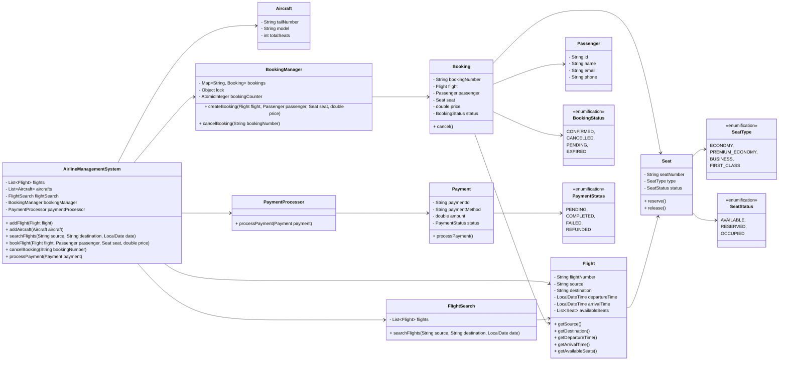
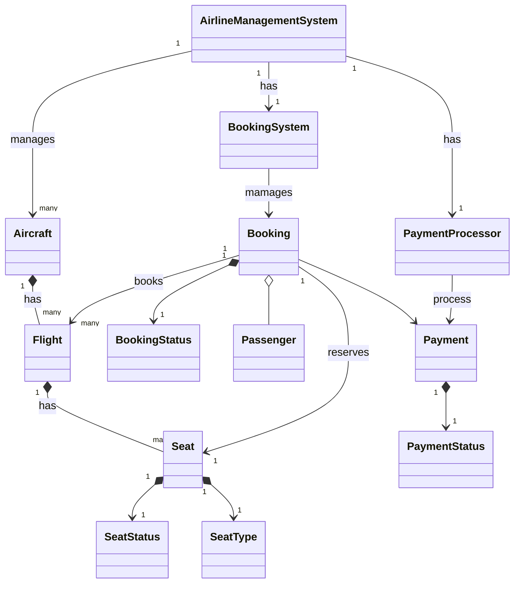

# Airline Reservation System

# Problem Satement
1. **Entities and Relationships**: What are the major entities and their relationships?
2. **Flight Scheduling**: How would flight scheduling, booking, and cancellations be managed in this system?
3. **Seat Assignment**: How would seat assignment and passenger information be maintained?

## Requirement
1. The airline management system should allow users to search for flights based on source, destination, and date.
2. Users should be able to book flights, select seats, and make payments.
3. The system should manage flight schedules, aircraft assignments, and crew assignments.
4. The system should handle passenger information, including personal details and baggage information.
5. The system should support different types of users, such as passengers, airline staff, and administrators.
6. The system should be able to handle cancellations, refunds, and flight changes.
7. The system should ensure data consistency and handle concurrent access to shared resources.
8. The system should be scalable and extensible to accommodate future enhancements and new features.

## Classes, Interfaces and Enumerations
1. The **Flight** class represents a flight in the airline management system, with properties such as flight number, source, destination, departure time, arrival time, and available seats.
2. The **Aircraft** class represents an aircraft, with properties like tail number, model, and total seats.
3. The **Passenger** class represents a passenger, with properties such as ID, name, email, and phone number.
4. The **Booking** class represents a booking made by a passenger for a specific flight and seat, with properties such as booking number, flight, passenger, seat, price, and booking status.
5. The **Seat** class represents a seat on a flight, with properties like seat number, seat type, and seat status.
6. The **Payment** class represents a payment made for a booking, with properties such as payment ID, payment method, amount, and payment status.
7. The **FlightSearch** class provides functionality to search for flights based on source, destination, and date.
8. The **BookingManager** class manages the creation and cancellation of bookings. It follows the Singleton pattern to ensure a single instance of the booking manager.
9. The **PaymentProcessor** class handles the processing of payments. It follows the Singleton pattern to ensure a single instance of the payment processor.
10. The **AirlineManagementSystem** class serves as the main entry point of the system, combining all the components and providing methods for flight management, booking, payment processing, and other operations

## Class Diagram

---
### Skeleton Design
