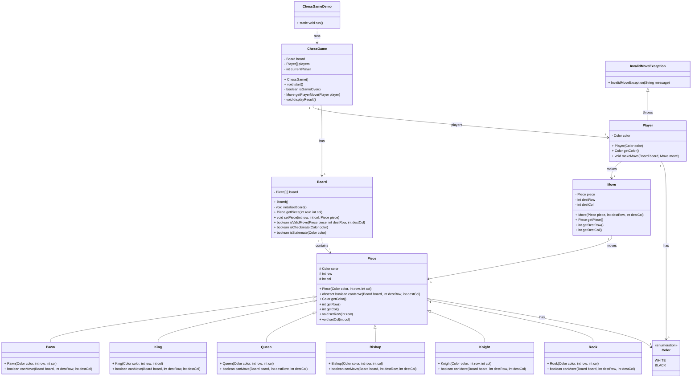

# ♟️Chess Game 

## Requirements
1. The chess game should follow the standard rules of chess.
2. The game should support two players, each controlling their own set of pieces.
3. The game board should be represented as an 8x8 grid, with alternating black and white squares.
4. Each player should have 16 pieces: 1 king, 1 queen, 2 rooks, 2 bishops, 2 knights, and 8 pawns.
5. The game should validate legal moves for each piece and prevent illegal moves.
6. The game should detect checkmate and stalemate conditions.
7. The game should handle player turns and allow players to make moves alternately.
8. The game should provide a user interface for players to interact with the game.

## Classes, Interfaces and Enumerations
1. The **Piece** class is an abstract base class representing a chess piece. -
   1. It contains common attributes such as color, row, and column, and declares an abstract method `canMove` to be implemented by each specific piece class.
2. The **King**, **Queen**, **Rook**, **Bishop**, **Knight**, and **Pawn** classes extend the Piece class and implement their respective movement logic in the `canMove` method.
3. The **Board** class represents the chess board and manages the placement of pieces. 
   1. It provides methods to `get` and `set` pieces on the board, check the validity of moves, and determine checkmate and stalemate conditions.
4. The **Player** class represents a player in the game and has a method to make a move on the board.
5. The **Move** class represents a move made by a player, containing the piece being moved and the destination coordinates.
6. The **Game** class orchestrates the overall game flow. It initializes the board, handles player turns, and determines the game result.
7. The **ChessGame** class is the entry point of the application and starts the game.

## Class Diagram

### Explanation:
- **Composition (`--> *`)**:  
  - `Board` contains multiple `Piece` objects.
  - `ChessGame` contains one `Board` and two `Player` objects.
- **Generalization (`<|--`)**:  
  - `Piece` is an abstract superclass of `Rook`, `Knight`, `Bishop`, `Queen`, `King`, and `Pawn`.
- **Dependency (`..>`)**:  
  - `ChessGameDemo` depends on `ChessGame` (calls its methods).
- **Associations**:  
  - `Player` has a `Color` and makes a `Move`.
  - `Move` operates on a `Piece`.
- **Exception Handling**:  
  - `Player` may throw `InvalidMoveException`.
