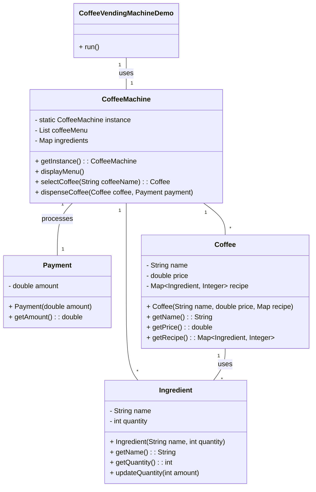
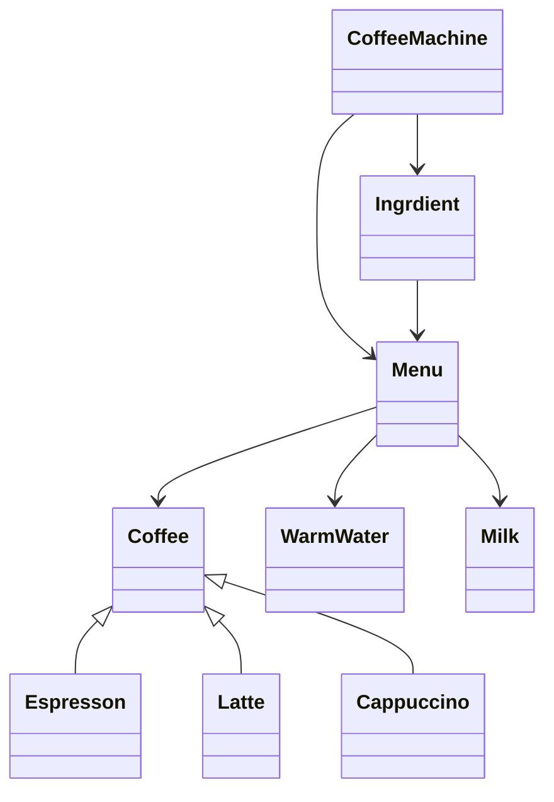

# Designing a Coffee Vending Machine

### Requirements
1. The coffee vending machine should support different types of coffee, such as espresso, cappuccino, and latte.
2. Each type of coffee should have a specific price and recipe (ingredients and their quantities).
3. The machine should have a menu to display the available coffee options and their prices.
4. Users should be able to select a coffee type and make a payment.
5. The machine should dispense the selected coffee and provide change if necessary.
6. The machine should track the inventory of ingredients and notify when they are running low.
7. The machine should handle multiple user requests concurrently and ensure thread safety.

### Classes, Interfaces and Enumerations
1. The **Coffee** class represents a coffee type with its name, price, and recipe (ingredients and their quantities).
2. The **Ingredient** class represents an ingredient used in making coffee, with its name and quantity. 
   1. It provides a synchronized method to update the quantity.
3. The **Payment** class represents a payment made by a user, with the amount paid.
4. The **CoffeeMachine** class is the main class that manages the coffee vending machine. 
   1. It follows the Singleton pattern to ensure a single instance of the machine.
5. The **CoffeeMachine** class initializes the coffee menu and ingredients in its constructor. 
   1. It provides methods to display the menu, select a coffee, dispense coffee, and update ingredient quantities.
6. The `hasEnoughIngredients` method checks if there are sufficient ingredients to make a selected coffee, while the updateIngredients method updates the ingredient quantities after dispensing a coffee.
7. The **CoffeeVendingMachine** class is the entry point of the application and demonstrates the usage of the coffee vending machine. 
   1. It creates an instance of the machine, displays the menu, and simulates concurrent user requests using an ExecutorService.

### Class Diagram

### Skeleton Diagram
