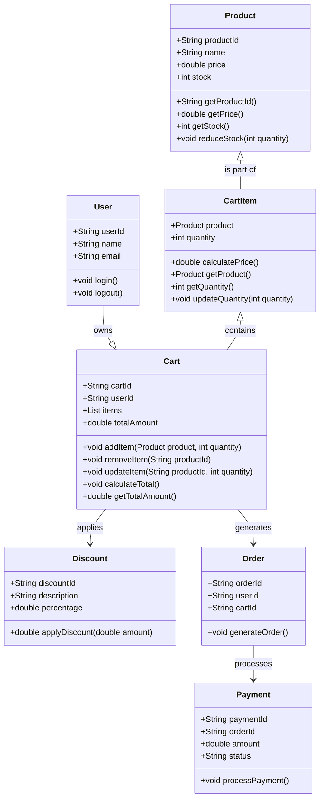

# Problem Statement

**Design a Shopping Cart for an E-commerce Website**

- Add, update, or remove items from the cart.
- Handle checkout and payment processing.
- Handle discounts as well.

---

## 1. Flow Diagram

### Steps:
1. User logs into the e-commerce system.
2. User browses products and adds, updates, or removes items in the cart.
3. User views the cart to review items, quantities, and total cost.
4. Discounts are applied (automatically or via promo code).
5. User proceeds to checkout:
   - Shipping details are provided.
   - Payment is processed.
6. Order is placed, and the user receives confirmation.

---

## 2. Objects

- **User**: Represents interaction with the system.
- **Product**: Represents items available for purchase.
- **Cart**: Represents the shopping cart holding the selected products.
- **CartItem**: Represents a specific product in the cart with a quantity.
- **Discount**: Represents the discount logic applied to the cart total.
- **Order**: Represents the order after checkout.
- **Payment**: Handles the payment process.

---

## 3. Class Diagram

