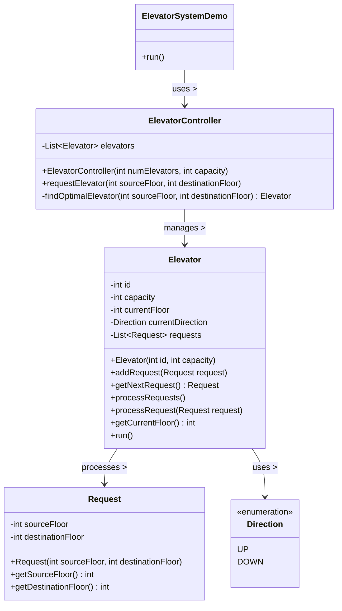

# Elevator System

## Requirements
1. The elevator system should consist of multiple elevators serving multiple floors.
2. Each elevator should have a capacity limit and should not exceed it.
3. Users should be able to request an elevator from any floor and select a destination floor.
4. The elevator system should efficiently handle user requests and optimize the movement of elevators to minimize waiting time.
5. The system should prioritize requests based on the direction of travel and the proximity of the elevators to the requested floor.
6. The elevators should be able to handle multiple requests concurrently and process them in an optimal order.
7. The system should ensure thread safety and prevent race conditions when multiple threads interact with the elevators.

## Classes, Interfaces and Enumerations
1. The `Direction` enum represents the possible directions of elevator movement (UP or DOWN).
2. The `Request` class represents a user request for an elevator, containing the source floor and destination floor.
3. The `Elevator` class represents an individual elevator in the system. It has a capacity limit and maintains a list of 4. requests. The elevator processes requests concurrently and moves between floors based on the requests.
4. The `ElevatorController` class manages multiple elevators and handles user requests. It finds the optimal elevator to serve a request based on the proximity of the elevators to the requested floor.
5. The `ElevatorSystem` class is the entry point of the application and demonstrates the usage of the elevator system.

## Class Diagram

### Explanation of Components:
1. **Direction (Enumeration)**:
   - Represents the direction of an elevator, either `UP` or `DOWN`.

2. **Request**:
   - Contains details of a request: the source floor and destination floor.

3. **Elevator**:
   - Represents a single elevator with attributes such as `id`, `capacity`, `currentFloor`, `currentDirection`, and a list of `requests`.
   - Handles the request processing logic, including moving between floors.

4. **ElevatorController**:
   - Manages a list of elevators.
   - Handles assigning requests to the most optimal elevator based on distance.

5. **ElevatorSystemDemo**:
   - Contains a `run` method to demonstrate the system's functionality by creating requests.

### Relationships:
- **ElevatorController**:
  - Manages multiple elevators and assigns them requests.
- **Elevator**:
  - Processes `Request` objects and moves in the appropriate `Direction`.
- **Request**:
  - Represents the user input for elevator usage.
- **ElevatorSystemDemo**:
  - Demonstrates interaction with the `ElevatorController` to simulate the elevator system.
