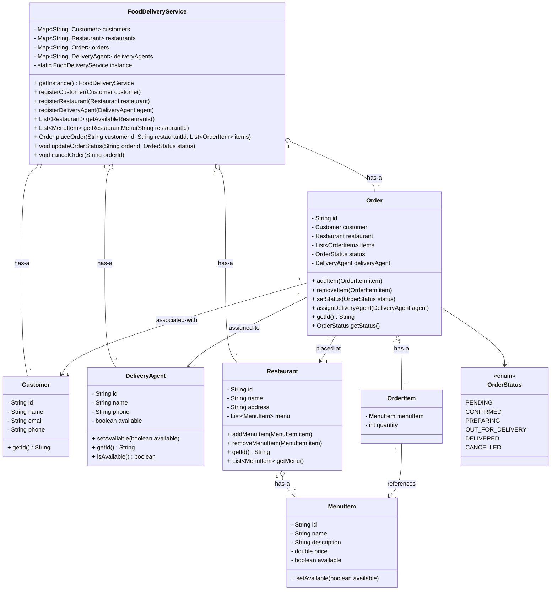

# Food Delivery System 

## Requirement
1. The food delivery service should allow customers to browse restaurants, view menus, and place orders.
2. Restaurants should be able to manage their menus, prices, and availability.
3. Delivery agents should be able to accept and fulfill orders.
4. The system should handle order tracking and status updates.
5. The system should support multiple payment methods.
6. The system should handle concurrent orders and ensure data consistency.
7. The system should be scalable and handle a high volume of orders.
8. The system should provide real-time notifications to customers, restaurants, and delivery agents.
---
## Objects
1. The **Customer** class represents a customer who can place orders. 
   1.  It contains customer details such as ID, name, email, and phone number.
2. The **Restaurant** class represents a restaurant that offers menu items.
   1.  It contains restaurant details such as ID, name, address, and a list of menu items. It provides methods to add and remove menu items.
3. The **MenuItem** class represents an item on a restaurant's menu. 
   1. It contains details such as ID, name, description, price, and availability status.
4. The **Order** class represents an order placed by a customer. 
   1. It contains order details such as ID, customer, restaurant, list of order items, status, and assigned delivery agent. 
   2. It provides methods to add and remove order items, update order status, and assign a delivery agent.
5. The **OrderItem** class represents an item within an order. 
   1. It contains the selected menu item and the quantity ordered.
6. The **OrderStatus** enum represents the different statuses an order can have, 
   1. such as PENDING, CONFIRMED, PREPARING, OUT_FOR_DELIVERY, DELIVERED, and CANCELLED.
7. The **DeliveryAgent** class represents a delivery agent who fulfills orders. 
   1. It contains details such as ID, name, phone number, and availability status.
8. The **FoodDeliveryService** class is the *main class* that manages the food delivery service. 
   1. It follows the `Singleton pattern` to ensure only one instance of the service exists.
   2. It provides methods to register customers, restaurants, and delivery agents, retrieve available restaurants and menus, place orders, update order status, cancel orders, and assign delivery agents to orders. 
   3. It also handles notifications to customers, restaurants, and delivery agents.
---
## Class Diagram
