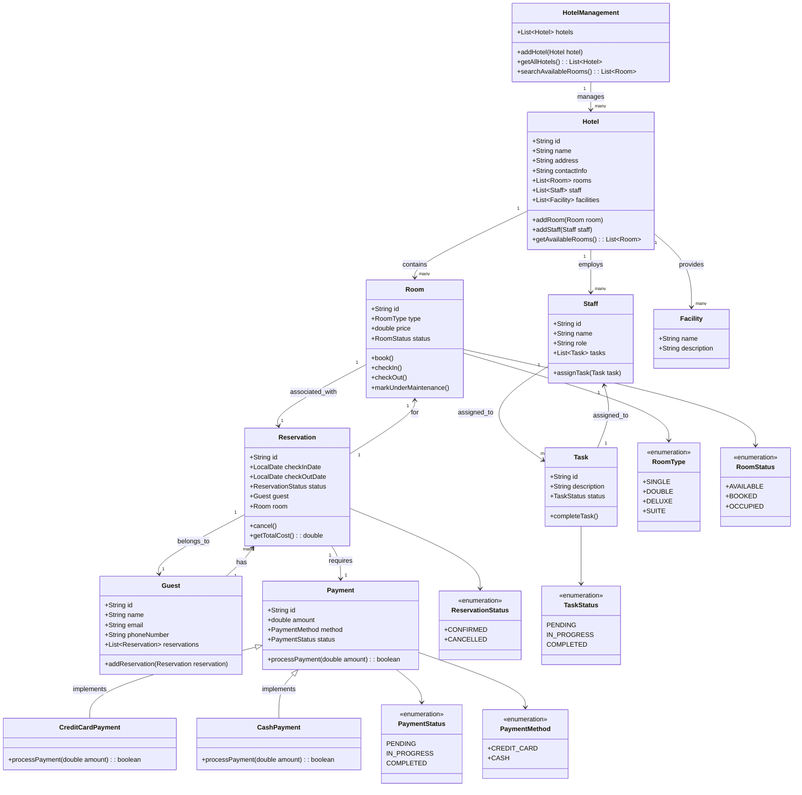

# Hotel Chain Management System

### **Requirements**

#### **1. Hotel Management**
- Manage multiple hotels under a single chain.
- Each hotel has:
  - A unique ID and name.
  - Address and contact information.
  - A list of rooms.
  - Facilities (e.g., gym, pool, parking).

#### **2. Room Management**
- Different room types (e.g., Single, Double, Suite).
- Room attributes:
  - Unique room number or ID.
  - Room type.
  - Price per night.
  - Status (Available, Booked, Occupied, Maintenance).

#### **3. Reservation Management**
- Book a room for a guest.
  - Store check-in and check-out dates.
  - Handle overbooked or unavailable rooms.
- Modify or cancel reservations.
- Reservation status: Confirmed, Cancelled, Checked-In, Checked-Out.
- Assign room(s) during check-in.

#### **4. Guest Management**
- Maintain guest information:
  - Name, contact details, and ID.
  - Reservation history.
- Support for corporate or group bookings.

#### **5. Billing and Payment**
- Generate bills based on:
  - Room charges (number of nights × price per night).
  - Additional charges (food, services, etc.).
- Payment options:
  - Credit Card, Debit Card, Cash, Digital Wallets.
- Payment status: Paid, Pending.

#### **6. Services and Amenities**
- Manage hotel services:
  - Room Service.
  - Restaurant and Food Ordering.
  - Concierge, Spa, Gym.
- Charge additional fees for premium services.

#### **7. Staff Management**
- Staff roles:
  - Receptionist, Housekeeping, Management, etc.
- Assign tasks to staff, e.g., cleaning, maintenance.
- Track working hours and shifts.

#### **8. Reporting and Analytics**
- Generate reports:
  - Occupancy rates.
  - Revenue and income per hotel or chain.
  - Guest feedback and ratings.
- Monitor reservations and cancellations.

#### **9. Scalability and Multi-Hotel Support**
- Support multiple hotels in different locations.
- Enable centralized and local hotel management.

#### **10. Security and Access Control**
- Role-based access:
  - Admin: Manage the entire system.
  - Manager: Manage a specific hotel.
  - Staff: Perform assigned tasks.
- Secure storage of guest and payment information.

#### **11. Notifications**
- Notify guests for:
  - Reservation confirmation.
  - Check-in and check-out reminders.
  - Payment receipts.
- Notify staff for tasks like room cleaning or maintenance.

#### **12. Maintenance**
- Mark rooms as "Under Maintenance."
- Record and schedule maintenance tasks.

---

### **Entities and Relationships**
Based on the above requirements, the key entities include:

1. **Hotel**
   - Attributes: ID, name, address, contact info, facilities.
   - Relationships: Has many rooms, managed by staff.

2. **Room**
   - Attributes: Room number, type, price, status.
   - Relationships: Belongs to a hotel, linked to reservations.

3. **Guest**
   - Attributes: ID, name, contact info, booking history.
   - Relationships: Can have multiple reservations.

4. **Reservation**
   - Attributes: ID, guest, room, check-in/out dates, status.
   - Relationships: Links guest and room.

5. **Bill**
   - Attributes: ID, reservation, total amount, payment status.
   - Relationships: Linked to reservation and payment.

6. **Payment**
   - Attributes: ID, amount, method, status.
   - Relationships: Linked to bill.

7. **Staff**
   - Attributes: ID, name, role, tasks.
   - Relationships: Belongs to a hotel, performs tasks.

8. **Task**
   - Attributes: ID, description, status.
   - Relationships: Assigned to staff, related to room or hotel.

---

### **Features for LLD**
Using the requirements, the LLD should include:
- **Classes** for each entity (e.g., `Hotel`, `Room`, `Guest`, `Reservation`, etc.).
- **Relationships** (e.g., aggregation for Hotel and Room, association for Guest and Reservation).
- **Methods** for behavior (e.g., `bookRoom`, `generateBill`, `checkIn`).
- **Enums** for fixed states (e.g., RoomStatus, ReservationStatus, PaymentMethod).
- **Interfaces** for extensibility (e.g., `Payment`).

---

### Example Use Cases for LLD
1. **Booking a Room**:
   - Check room availability for a hotel.
   - Create a reservation with guest and room details.
   - Update room status to Booked.

2. **Checking In**:
   - Update reservation status to Checked-In.
   - Change room status to Occupied.

3. **Processing Payment**:
   - Calculate bill based on room and additional charges.
   - Process payment and update status.

4. **Managing Staff Tasks**:
   - Assign cleaning tasks to housekeeping.
   - Notify staff when tasks are created.

---
### **Class Diagram**

