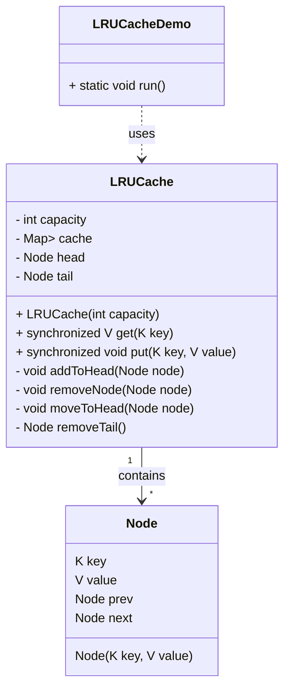

# Design LRU Cache 

## Requirement
1. The LRU cache should support the following operations:
   - **put(key, value)**: Insert a key-value pair into the cache. If the cache is at capacity, remove the least recently used item before inserting the new item.
   - **get(key)**: Get the value associated with the given key. If the key exists in the cache, move it to the front of the cache (most recently used) and return its value. If the key does not exist, return -1.
2. The cache should have a fixed capacity, specified during initialization.
3. The cache should be thread-safe, allowing concurrent access from multiple threads.
4. The cache should be efficient in terms of time complexity for both put and get operations, ideally O(1).

## Classes, Interfaces and Enumerations
1. **Node**:  class represents a node in the doubly linked list, containing the key, value, and references to the previous and next nodes.
2. **LRUCache**: class implements the LRU cache functionality using a combination of a *hash map* (cache) and a *doubly linked list* (head and tail).
3. The `get method` retrieves the value associated with a given key. 
   1. If the key exists in the cache, it is moved to the head of the linked list (most recently used) and its value is returned. 
   2. If the key does not exist, null is returned.
4. The `put method` inserts a key-value pair into the cache. 
   1. If the key already exists, its value is updated, and the node is moved to the head of the linked list. 
   2. If the key does not exist and the cache is at capacity, the least recently used item (at the tail of the linked list) is removed, and the new item is inserted at the head.
5. The `addToHead`, `removeNode`, `moveToHead`, and `removeTail` methods are helper methods to manipulate the doubly linked list.
6. The synchronized keyword is used on the get and put methods to ensure thread safety, allowing concurrent access from multiple threads.
7. **LRUCacheDemo**: class demonstrates the usage of the LRU cache by creating an instance of LRUCache with a capacity of 5, performing various put and get operations, and printing the results.

## UML- Class Diagram
