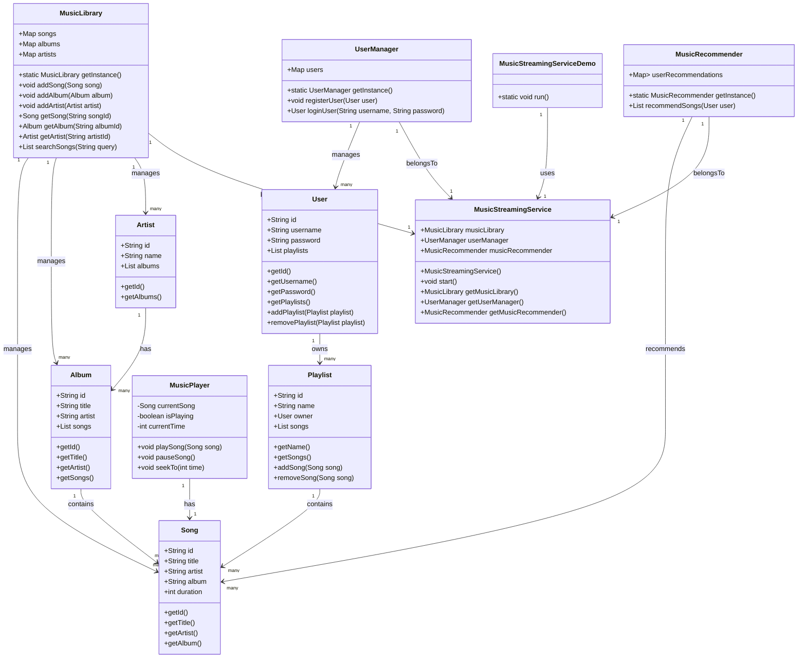

# Designing an Online Music Streaming Service - Spotify

### Requirements
1. The music streaming service should allow users to browse and search for songs, albums, and artists.
2. Users should be able to create and manage playlists.
3. The system should support user authentication and authorization.
4. Users should be able to play, pause, skip, and seek within songs.
5. The system should recommend songs and playlists based on user preferences and listening history.
6. The system should handle concurrent requests and ensure smooth streaming experience for multiple users.
7. The system should be scalable and handle a large volume of songs and users.
8. The system should be extensible to support additional features such as social sharing and offline playback.

### Classes, Interfaces and Enumerations
1. The **Song**, **Album**, and **Artist** classes represent the basic entities in the music streaming service, with properties such as ID, title, artist, album, duration, and relationships between them.
2. The **User** class represents a user of the music streaming service, with properties like ID, username, password, and a list of playlists.
3. The **Playlist** class represents a user-created playlist, containing a list of songs.
4. The **MusicLibrary** class serves as a central repository for storing and managing songs, albums, and artists. It follows the Singleton pattern to ensure a single instance of the music library.
5. The **UserManager** class handles user registration, login, and other user-related operations. It also follows the Singleton pattern.
6. The **MusicPlayer** class represents the music playback functionality, allowing users to play, pause, skip, and seek within songs.
7. The **MusicRecommender** class generates song recommendations based on user preferences and listening history. It follows the Singleton pattern.
8. The **MusicStreamingService** class is the main entry point of the music streaming service. It initializes the necessary components, handles user requests, and manages the overall functionality of the service.

### Class Diagram
