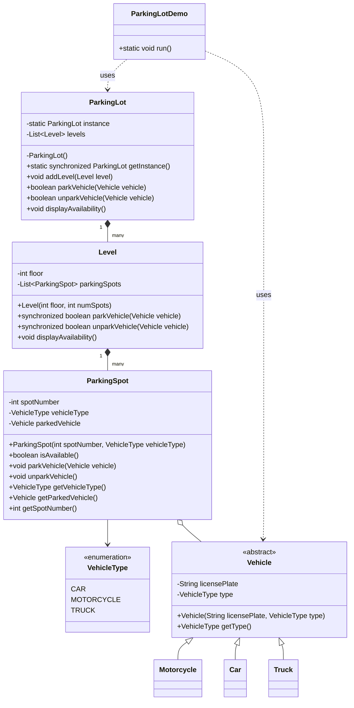

# Parking Lot

### Requirements
1. The parking lot should have multiple levels, each level with a certain number of parking spots.
2. The parking lot should support different types of vehicles, such as cars, motorcycles, and trucks.
3. Each parking spot should be able to accommodate a specific type of vehicle.
4. The system should assign a parking spot to a vehicle upon entry and release it when the vehicle exits.
5. The system should track the availability of parking spots and provide real-time information to customers.
6. The system should handle multiple entry and exit points and support concurrent access.
---
### Classes/Interfaces/Enum
1. The **ParkingLot** class follows the Singleton pattern to ensure only one instance of the parking lot exists. It maintains a list of levels and provides methods to park and unpark vehicles.
2. The **Level** class represents a level in the parking lot and contains a list of parking spots. It handles parking and unparking of vehicles within the level.
3. The **ParkingSpot** class represents an individual parking spot and tracks the availability and the parked vehicle.
4. The **Vehicle** class is an abstract base class for different types of vehicles. It is extended by Car, Motorcycle, and Truck classes.
5. The **VehicleType** enum defines the different types of vehicles supported by the parking lot.
6. Multi-threading is achieved through the use of *synchronized* keyword on critical sections to ensure thread safety.
7. The **Main** class demonstrates the usage of the parking lot system.
---
### Class Diagram
