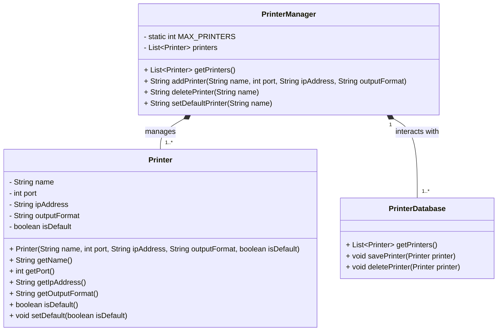

# Problem Statement

**Design a Printer Setting for Windows Application**

- View Printers: Display a list of all configured printers and their details.
- Add Printer:
    - Allow the addition of a new printer with necessary details.
    - Automatically set the newly added printer as the default printer.
- Delete Printer:
    - Allow deletion of non-default printers only.
- Set Default Printer:
    - Allow setting an existing printer as the default printer.
  
---

## 1. Flow Diagram

### Steps:
1. Populate Printer Details:

- Fetch the list of printers from the system or database.
- Display details (Printer Name, Port Number, IP Address, Output Format) in a user-friendly UI.

2. Add a New Printer:

- Validate the input for required fields and ensure unique Printer Name.
- Check if the total number of printers is less than 5.
- Add the printer to the list/database.
- Set the newly added printer as the default printer.

3. Delete Existing Printers:

- Check if the selected printer is not the default printer.
- Remove the printer from the list/database.

4. Set Default Printer:

- Update the selected printer's status to default.
- Ensure the previous default printer's status is updated to non-default.

## 2. Objects
1. Printer
- Represents a printer with attributes such as name, port number, IP address, and output format.
2. PrinterManager
- Handles operations such as adding, deleting, and setting default printers.
- Maintains the list of configured printers.
3. PrinterDatabase
- Mock database to simulate data storage for printers.

## 3. Class Diagram

